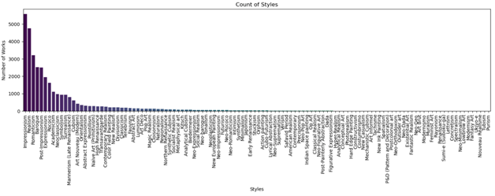
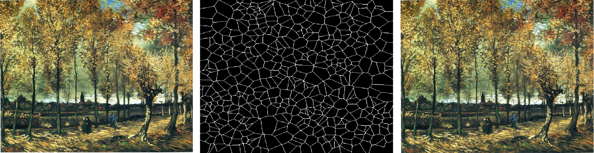
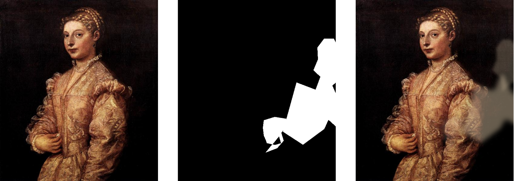
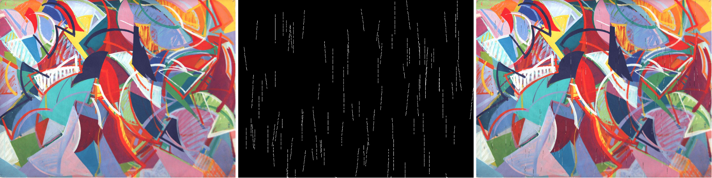
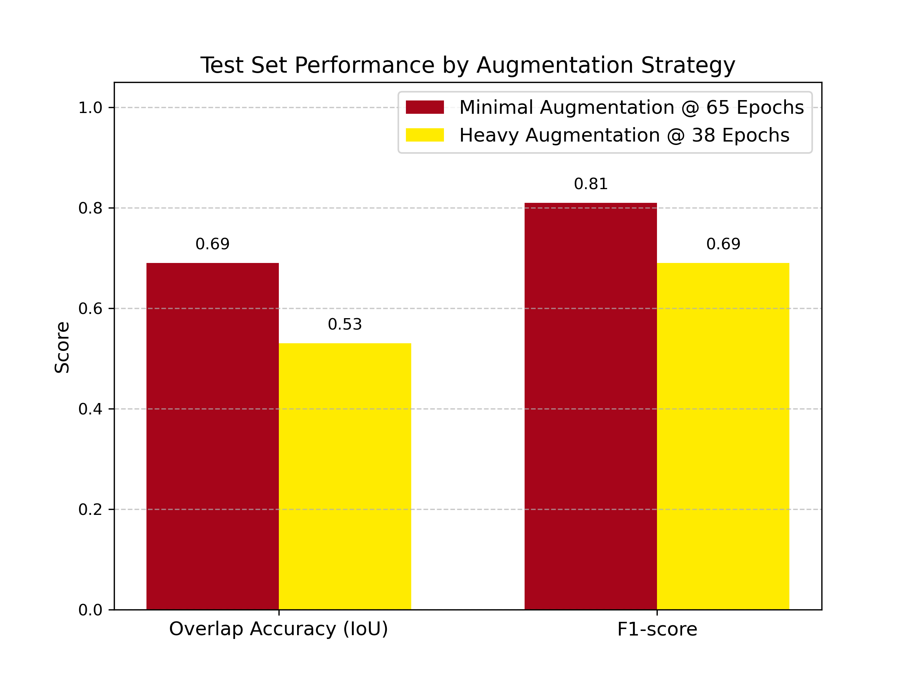
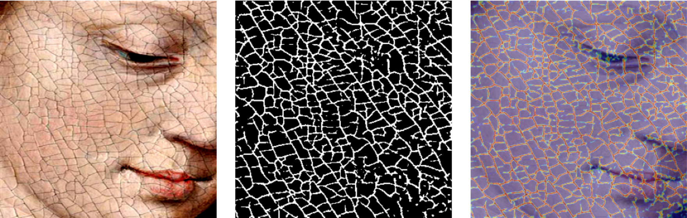
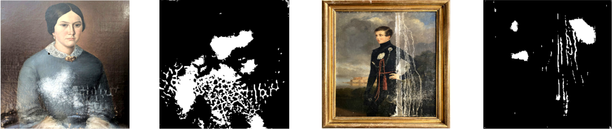
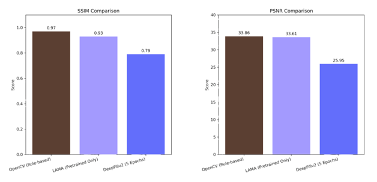

# The Art of Restoration: An AI Pipeline for Assisting in Painting Restoration
AI model that visually restores deteriorated paintings to guide and support art conservators during treatment.

## Abstract
This study explores the use of artificial intelligence to assist in the process of painting restoration by developing an AI-based pipeline for detecting and virtually inpainting surface-level damages such as craquelure, water stains, and scratches. Leveraging a curated dataset of over 34,000 canvas-based paintings sourced from WikiArt, we addressed the scarcity of paired damaged-undamaged training data by generating synthetic damage through a custom augmentation pipeline. For damage detection, we trained a U-Net segmentation model that achieved an Intersection-over-Union (IoU) of 0.69 and an F1-score of 0.81 on the test set. Notably, the model also generalized well to real-world damaged artworks despite being trained solely on synthetic data. For inpainting, we evaluated three methods: OpenCV inpainting, pretrained LaMa, and a lightly trained DeepFill v2. OpenCV performed best for localized damages, while LaMa showed superior handling of larger damaged regions; DeepFill required further training to yield competitive results. The findings demonstrate that even with limited data and compute resources, AI-based tools can provide valuable support to conservators by highlighting damaged areas and generating plausible restoration suggestions. Furthermore, this work underscores the promise of using synthetic data to overcome training limitations in cultural heritage applications. 

## Highlights 

1. Synthetic Damage Pipeline to Overcome Data Scarcity 
Developed a scalable pipeline to generate synthetic craquelure, water stains, and scratches, enabling supervised training without large annotated datasets. 

2. Strong Damage Detection with Real-World Generalization 
Achieved IoU 0.69 and F1 0.81 with a U-Net trained on synthetic data, successfully generalizing to real-world damaged paintings. 

3. Comparative Evaluation of Inpainting Methods for Art Restoration 
Benchmarked OpenCV, LaMa, and DeepFill v2 across damage types, highlighting strengths, limitations, and trade-offs for art restoration. 

## Introduction

Artistic expression is a fundamental facet of human culture — a dialogue that transcends generations. Through brushstrokes and vibrant pigments, artists document the human experience, offering valuable insights into history and society. Each work of art serves as a cultural artifact; preserving it safeguards the heritage it embodies. This underscores the importance of art conservation and restoration. Conservation aims to prolong an artwork’s lifespan by mitigating factors that cause deterioration, while restoration — a branch of conservation — involves interventions to return an artwork closer to its original or intended state. Although these practices date back centuries, they have evolved substantially, particularly with the integration of new technologies (Encyclopaedia Britannica, n.d.) [1]. 

## Motivation

Modern art restoration is a complex, highly manual process that requires significant expertise and judgment. Before intervention, restorers must carefully analyze a painting’s condition, identify damaged areas, and plan appropriate treatments. While digital tools exist for documentation and visualization, AI-based support remains underexplored in this domain. Machine learning models capable of automatically detecting surface damage and proposing plausible virtual restorations could provide valuable assistance to conservators — helping them visualize treatment outcomes, explore alternatives, and prioritize efforts. Such tools can enhance, not replace, expert judgment in the restoration process. 

## Problem Statement

How can a combined AI pipeline generate visually plausible restorations of paintings with water damage, scratches, or craquelure to support art conservators during restoration planning and treatment? 

## Study Overview

This study investigates the use of machine learning to assist art restorers through an AI-based pipeline that mirrors key stages in the restoration workflow: identifying damaged regions and generating virtual inpainting suggestions. The project focuses on three common types of surface damage: scratches, craquelure (cracks), and water damage. 

The proposed pipeline consists of two main components: 
1. Damage Detection — implemented using U-Net, a Convolutional Neural Network (CNN) architecture optimized for semantic segmentation, trained on synthetically generated damage masks. 
2. Virtual Inpainting — evaluated through three approaches: OpenCV-based inpainting (as a baseline), LaMa (a state-of-the-art model using Fourier convolution layers), and DeepFill (a GAN-based model trained on the project dataset under limited compute constraints). 

Data collection, synthetic damage generation, model design, and evaluation methodology are detailed in the following sections. 

## Methodology
### Dataset Description
The study requires high-quality digital images of paintings to serve as the foundation for model training and evaluation. These images were sourced through web scraping from WikiArt, a large online visual art encyclopedia. To automate this process, the study employed the publicly available scrapWikiArt GitHub notebooks. 

Since the project focuses on surface damage restoration, the dataset was restricted to canvas-based paintings, where such types of deterioration (scratches, craquelure, water damage) are most relevant. After filtering, the final dataset consists of 34,658 paintings spanning 116 different artistic styles — with the largest representation coming from Impressionism, Realism, and Romanticism. 


<p style="font-family: Georgia, serif; font-size: 15px; font-style: italic; margin-top: 4px;">
<b>Figure 1.</b> Number of painting styles in the dataset
</p>

### Data Preprocessing
One of the core challenges in building an AI pipeline for art restoration is the lack of suitable training data. High-quality images of damaged artworks are rare, and paired examples of the same painting in both damaged and undamaged forms are even more scarce. To address this gap, the team developed a synthetic data generation pipeline that emulates common types of visual damage on clean artworks—specifically craquelure, water stains, and scratches—allowing supervised training of detection and inpainting models.




<p style="font-family: Georgia, serif; font-size: 15px; font-style: italic; margin-top: 4px;">
<b>Figure 2.</b> Examples of synthetic damage types applied to clean artworks. Each row shows an original image (left), the damage mask (center), and the augmented result (right). From top to bottom: craquelure, water discoloration, and scratches.
</p>

The clean images used for this purpose were sourced from WikiArt, covering a wide range of painting styles and periods. No standardization was applied to image resolution or aspect ratio in order to preserve the natural variation present in the dataset. Each type of damage was implemented as a separate class using a combination of albumentations, OpenCV, PIL, and NumPy. Craquelure was simulated using crack masks blended with earthy tints, water stains were rendered as blurred blotches with irregular shapes, and scratches were drawn as sharp streaks with directional filters. While rule-based, these augmentations were visually tuned rather than validated against expert annotations.

The system output binary image-mask pairs, where each mask identified the location of the applied damage. This setup enabled training of pixel-wise damage detection models such as U-Net. Although some types of degradation—particularly scratches—were more difficult to model convincingly, the synthetic damage library played a critical role in making model training possible. It provided a scalable and controllable way to simulate degradation, forming the foundation for the later stages of the restoration pipeline.

### Damage Detection
To detect regions of visual degradation within paintings, the team employed a convolutional neural network based on the U-Net architecture. U-Net is widely used in image segmentation tasks, particularly when precise pixel-level classification is required. This made it well-suited for the problem of identifying damaged regions in artworks, such as cracks, stains, or scratches.

The architecture of U-Net consists of an encoder-decoder structure. The encoder progressively reduces the spatial resolution of the image to capture high-level contextual features, while the decoder restores the resolution, allowing the model to produce a segmentation map that aligns with the original image dimensions. Crucially, U-Net incorporates skip connections between corresponding layers in the encoder and decoder. These connections allow fine-grained spatial features—such as the outlines of cracks or subtle watermarks—to propagate directly to the reconstruction layers, improving localization accuracy without sacrificing global context.

The U-Net implementation used in this project was constructed with a ResNet-34 backbone pretrained on ImageNet. Input images were resized to 320×320 pixels, and training was conducted using a batch size of 32 for up to 100 epochs. The loss function combined Dice Loss and Binary Focal Loss to balance segmentation accuracy and robustness to class imbalance. Optimization was performed using the Adam optimizer with a learning rate of 1e-4. The output layer used a sigmoid activation function, as the task was formulated as binary segmentation. Evaluation metrics included Intersection-over-Union (IoU), precision, recall, and F1-score. To enhance generalization and robustness, two augmentation pipelines were explored: a minimal pipeline and a heavy pipeline. The heavy pipeline introduced a combination of geometric and photometric distortions, including random shifts, scaling, rotations, blur, contrast variation, noise, and perspective warping—emulating diverse real-world imaging conditions.

### Virtual Inpainting
For the virtual inpainting component of the pipeline, the study explored three approaches, each representing a different level of algorithmic complexity and computational requirements:
- OpenCV Inpainting: This classical computer vision method fills in damaged regions by propagating information from surrounding pixels. It is fast and simple to implement, but is best suited for repairing small, localized defects where nearby texture can be effectively extended. In this study, OpenCV’s Telea algorithm was used.
- LaMa (Large Mask Inpainting): LaMa is a deep learning-based inpainting model designed to handle large and complex missing regions. It combines convolutional layers with Fast Fourier Convolution (FFC) blocks, allowing the model to capture both local and global image context. In this study, a pretrained LaMa model was used to provide an out-of-the-box performance benchmark.
- DeepFill v2: DeepFill v2 is a Generative Adversarial Network (GAN)-based model specifically designed for image inpainting. It consists of two main components: a Generator, which synthesizes plausible content for the missing regions, and a Discriminator, which evaluates the realism of the generated output. The two components are trained adversarially — the Generator progressively improves its outputs to fool the Discriminator, resulting in increasingly refined and realistic inpainted images. In this project, DeepFill v2 was trained on the project’s dataset under limited compute constraints.

## Results
### Damage Detection
To evaluate the effectiveness of the damage detection model, the U-Net architecture was trained under two different augmentation regimes: minimal augmentation and heavy augmentation. These strategies aimed to test the model's robustness under varying levels of image transformation and simulate different imaging conditions.

To evaluate model performance, the following metrics were used:
- Intersection-over-Union (IoU): Measures the overlap between the predicted damage mask and the ground truth, relative to their union. A higher IoU indicates more accurate localization of damaged regions.
- F1-score: The harmonic mean of precision and recall. It balances false positives and false negatives, providing a robust indicator of how well the model identifies damage without over- or under-segmenting.

These metrics were chosen to reflect both the spatial accuracy (IoU) and detection quality (F1) of the model, which are critical in applications where conservators must trust that the highlighted regions correspond to meaningful surface degradation.

On the held-out test set, the model trained with minimal augmentation outperformed the model trained with heavy augmentation across both evaluation metrics. Specifically, the minimal augmentation model achieved an Intersection-over-Union (IoU) score of 0.69 and an F1-score of 0.81 after 65 epochs of training. In contrast, the heavy augmentation model, evaluated after 38 epochs (the point of best validation performance), attained an IoU of 0.53 and an F1-score of 0.69.

These results suggest that while heavier augmentation can improve generalization in many computer vision tasks, it may also introduce excessive noise or unrealistic distortions when applied to synthetic damage detection. Given that the damage masks were already artificially generated, additional augmentation may have compounded the visual divergence from real-world artifacts. As a result, the model benefited more from subtle perturbations than from aggressive transformations. This finding underscores the importance of tuning augmentation pipelines carefully, especially in contexts where the synthetic nature of the data introduces its own distributional shift.


<p style="font-family: Georgia, serif; font-size: 15px; font-style: italic; margin-top: 4px;">
<b>Figure 3.</b> Test set performance of U-Net under minimal and heavy augmentation strategies, evaluated by IoU and F1-score.
</p>

To assess the practical viability of the damage detection model, it was also applied to real-world images of historically damaged paintings that were not part of the training dataset. Despite being trained exclusively on synthetically degraded images, the model successfully highlighted regions of interest that aligned with visible cracks, stains, and surface deterioration present in the actual artworks. This suggests that the learned representations were not overly reliant on specific augmentation patterns but captured more general visual characteristics of damage. While the model is not perfect—performance may vary depending on the scan quality, lighting, and artistic style—it demonstrates promising potential as a tool for assisting conservators in identifying areas of concern, especially in digitized archival materials where no manual annotations are available.



<p style="font-family: Georgia, serif; font-size: 15px; font-style: italic; margin-top: 4px;">
<b>Figure 4.</b> Damage detection model applied to real-world paintings. Predicted damage masks align with visible degradation such as cracks and stains, despite the model being trained only on synthetically damaged data.
</p>

### Virtual Inpainting
The three inpainting methods were evaluated using two standard image quality metrics:
- Structural Similarity Index Measure (SSIM) — assesses perceptual similarity between the inpainted image and the original, considering structure, luminance, and contrast. This is particularly important for preserving the visual integrity of artistic details.
- Peak Signal-to-Noise Ratio (PSNR) — measures the fidelity of the inpainted image at the pixel level by comparing it to the original. Higher PSNR indicates greater similarity.


<p style="font-family: Georgia, serif; font-size: 15px; font-style: italic; margin-top: 4px;">
<b>Figure 5.</b> Test set performance of different virtual inpainting methods and models, evaluated by SSIM and PSNR.
</p>

Among the evaluated methods, OpenCV inpainting produced the highest SSIM and PSNR scores. This outcome is likely due to the nature of the synthetic damages used in this study, which were relatively controlled and localized — a scenario well-suited to OpenCV’s local pixel-based repair approach.

In contrast, LaMa was evaluated in its pretrained form (trained on generic images), and DeepFill v2 was trained for only 5 epochs on the project dataset. The limited training of DeepFill reflects the study’s computational constraints. Despite this, the evaluation provided valuable insights into the potential performance of more advanced deep learning models under realistic project limitations.


<p style="font-family: Georgia, serif; font-size: 15px; font-style: italic; margin-top: 4px;">
<b>Figure 6.</b> Virtual inpainting methods applied to real-world paintings.
</p>

Implementing the three inpainting methods on the case study images yielded distinct visual outcomes:
For images with localized damage (e.g. cracks), OpenCV inpainting produced the most visually acceptable results. It effectively smoothed out fine cracks by leveraging pixel information from surrounding regions. The local nature of the damage aligned well with OpenCV’s strengths, resulting in high perceptual similarity to the original.

In contrast, DeepFill v2, trained for only five epochs, exhibited poor reconstruction quality at this early training stage. The model frequently generated incorrect color tones and incoherent textures in the damaged regions, indicating that it had not yet sufficiently learned the underlying patterns and content of the paintings.
                                                                                            
LaMa, used in its pretrained form, produced results that were smoother and more globally consistent than OpenCV, particularly on larger damaged areas. However, due to domain mismatch (pretraining on generic images), certain stylistic inconsistencies remained.

When applied to images with larger damaged regions (e.g. extensive water damage), the differences between methods became more pronounced:
- OpenCV introduced visible pixelation and artifacts in areas where larger contextual understanding was required.
- LaMa produced a smoother and more coherent reconstruction, better handling the need for global context.
- DeepFill v2 continued to struggle, with significant artifacts and color inconsistencies, again reflecting insufficient training.

These qualitative observations reinforce the trade-offs between model simplicity, training effort, and restoration quality across different damage types and sizes.

![Virtual inpainting models applied to damage](./images/virtual-inpainting-sample-test-set.png
<p style="font-family: Georgia, serif; font-size: 15px; font-style: italic; margin-top: 4px;">
<b>Figure 7.</b> Virtual inpainting methods applied to the test dataset paintings.
</p>

## Conclusions and Recommendations

This project demonstrates the potential for artificial intelligence to support—not replace—the work of art conservators. By building a modular restoration pipeline, the team was able to design and train models targeted at specific types of visual damage, offering flexibility for a range of use cases in cultural heritage preservation.

The results indicate that with careful design, neural networks such as U-Net can reliably detect surface-level degradation in paintings. These models, trained entirely on synthetic damage, exhibited generalization capabilities when applied to real historical artworks—successfully identifying regions of visual deterioration despite having never encountered such images during training.

Perhaps most notably, this work highlights the feasibility of using emulated damage to scale training data. In the absence of large annotated datasets of damaged paintings, the team was still able to achieve strong detection performance through a carefully crafted augmentation pipeline. This approach may offer a path forward for similar applications where data scarcity is a central barrier.

## Future Directions

Looking ahead, several enhancements could significantly improve the scope and impact of this work. First, forming partnerships with museums and cultural institutions could grant access to high-resolution scans of damaged artworks, enabling better model evaluation and possibly more realistic training data.

Second, the development of damage-type-specific models—tailored, for instance, to detect only craquelure or water stains—could enhance performance by reducing ambiguity in the training objectives and increasing interpretability for conservators.

Lastly, a key limitation of this project was the lack of expert input during mask generation and model validation. Without guidance from trained conservators, there is a risk that the system might misclassify intentional artistic textures or natural aging as damage. To address this, future work could involve co-creating ground truth annotations with experts to improve both the quality and trustworthiness of the model’s predictions.

Ultimately, the goal of this work is not to automate the art restoration process but to explore how AI can serve as a valuable tool—amplifying human expertise and enabling more informed, efficient decision-making in conservation practice.

## References

# Setup Guide
## Install the environment
From the project root, run:
`bash setup.sh`

This will:

- Create the art-restoration-ai Conda environment

- Install dependencies from configs/environment.yml

- Register the environment as a Jupyter kernel

## Importing Damage Effects
Add this to the top of your notebook to enable imports from src/:
```
import sys, os

project_root = os.path.abspath("..")
src_path = os.path.join(project_root, "src")
if src_path not in sys.path:
    sys.path.append(src_path)
```

Then you can import:
```
from damage_effects import TearDamage
```